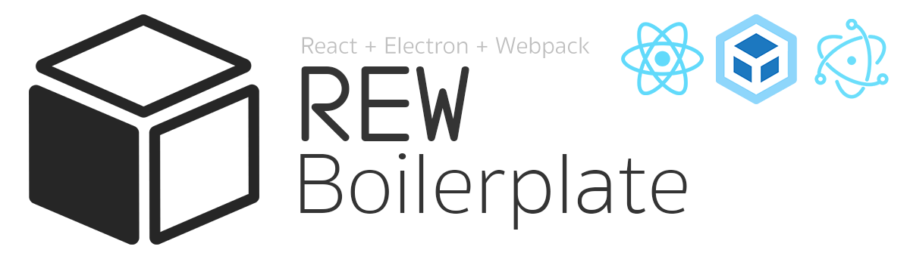
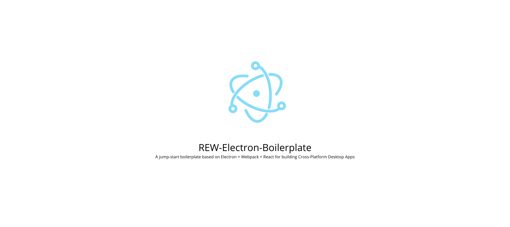

<p align="center">
  
</p>
<br>
<br>


# REW - Electron, React and Webpack boilerplate

[](https://david-dm.org/hcorta/REW-electron-boilerplate)
[](https://david-dm.org/hcorta/REW-electron-boilerplate?type=dev)

A minimal jump-start boilerplate based on Electron + Webpack + React for building Cross-Platform Desktop Apps

<p align="center">
  
</p>
<br>


## Table of Contents

* [Install](#install)
* [Start Development](#start-development)
* [Packaging for Production](#packaging-for-production)
* [Code of Conduct](#code-of-conduct)
* [License](#license)

<br>

## Install

First, clone the repo via git:
```
git clone https://github.com/hcorta/REW-electron-boilerplate
```

And then install the dependencies with yarn.
```
$ cd your-project-name
$ yarn
```

## Starting Development

Start the app in the dev environment. This starts the renderer process in hot-module-replacement mode and starts a webpack dev server that sends hot updates to the renderer process:

```
$ yarn start
```

## Packaging for Production

To package apps for the local platform:

```
$ yarn run package
```


## Code of Conduct

[Contributor Code of Conduct](public/docs/CODE_OF_CONDUCT.md). By participating in this project you agree to abide by its terms.

## License

MIT © [Hugo Corta](https://github.com/hcorta).
