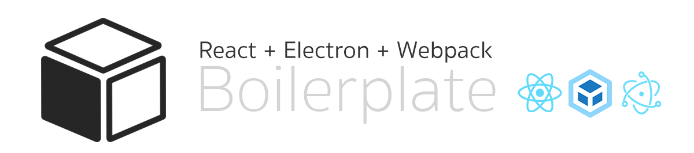

<div align="center">
  
  <p>A minimal jump-start boilerplate based on Electron + Webpack + React for building Cross-Platform Desktop Apps</p>
</div>

<div align="center">

  [](https://travis-ci.com/hcorta/REW-electron-boilerplate)
  [](https://david-dm.org/hcorta/REW-electron-boilerplate)
  [](https://david-dm.org/hcorta/REW-electron-boilerplate?type=dev)
  [](https://opensource.org/licenses/MIT)
  [](http://makeapullrequest.com)

</div>

<p align="center" style="box-shadow:0px 4px 10px rgba(0,0,0,0.5)">
  
</p>

<br>

## Table of Contents

* [Overview](#overview)
* [Install](#install)
* [Start Development](#start-development)
* [Packaging for Production](#packaging-for-production)
* [Code of Conduct](#code-of-conduct)
* [License](#license)

<br>

## Overview
Modern web development practices today require a lot of setup with things like webpack to bundle your code, babel for transpiling, eslint for linting, and so much more that the list just goes on. Unfortunately when creating electron applications, all of that setup just became much more difficult. 

The primary aim of electron-webpack is to eliminate all preliminary setup with one simple install so you can get back to developing your application.

<br>

## Install

Create a directory of your choice, and download the repo using git clone:

```
git clone https://github.com/hcorta/rew-electron-boilerplate YOUR_PROJECT_NAME
cd YOUR_PROJECT_NAME
```

<br>

And then install the dependencies with **`yarn`** *(recommended)*.

```
yarn
```

<br>

After completing this steps, you will find the following project structure. No configuration needed, just the files you need to build your app.

```
YOUR_PROJECT_NAME
├── .babel.rc
├── .eslintrc
├── .gitignore
├── .travis.yml
├── LICENSE
├── main.js
├── package.json
├── postcss.config.js
├── README.md
└── yarn.lock
├── config/
│   ├── webpack.dev.js
│   └── webpack.prod.js
├── dist/
│   ├── jquery.boilerplate.js
│   └── jquery.boilerplate.min.js
└── src
    ├── App.css
    ├── App.js
    └── index.js
```

<br>

## Starting Development

Start the app in the dev environment. This starts the renderer process in hot-module-replacement mode and starts a webpack dev server that sends hot updates to the renderer process:

```
yarn start
```

<br>

## Packaging for Production

To package the app for the local platform:

```
yarn package
```

<br>

## Contributing
**Working on your first Pull Request?** You can learn how from this *free* series [How to Contribute to an Open Source Project on GitHub](https://egghead.io/series/how-to-contribute-to-an-open-source-project-on-github)

<br>

## Code of Conduct

[Contributor Code of Conduct](public/docs/CODE_OF_CONDUCT.md). By participating in this project you agree to abide by its terms.

<br>

## License

**REW-electron-boilerplate** is open source software licensed as MIT © [Hugo Corta](https://github.com/hcorta).
